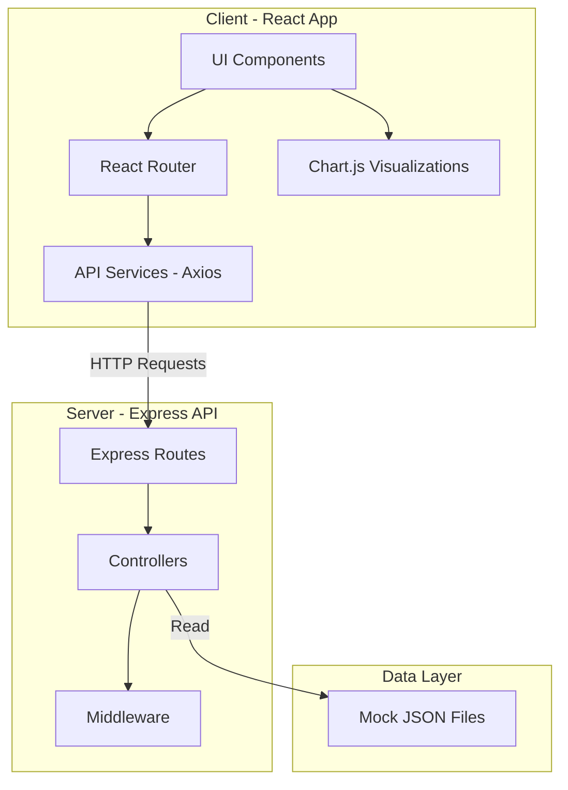

# Marketing Dashboard - Project Structure Plan

## Overview

This document outlines the project structure for a Marketing Dashboard application with a React frontend and Node.js/Express backend, both using TypeScript.

## Project Structure

```
ai-coding-dashboard/
├── client/                     # React Frontend (Vite + Tailwind + TypeScript)
│   ├── public/
│   │   └── vite.svg
│   ├── src/
│   │   ├── assets/            # Static assets (images, fonts, etc.)
│   │   ├── components/        # Reusable React components
│   │   │   └── .gitkeep
│   │   ├── pages/             # Page components for routing
│   │   │   └── .gitkeep
│   │   ├── hooks/             # Custom React hooks
│   │   │   └── .gitkeep
│   │   ├── services/          # API service functions (Axios)
│   │   │   └── api.ts
│   │   ├── types/             # TypeScript type definitions
│   │   │   └── index.ts
│   │   ├── utils/             # Utility functions
│   │   │   └── .gitkeep
│   │   ├── App.tsx            # Main App component with routing
│   │   ├── main.tsx           # Application entry point
│   │   └── index.css          # Global styles with Tailwind
│   ├── index.html
│   ├── package.json
│   ├── tsconfig.json
│   ├── tsconfig.node.json
│   ├── vite.config.ts
│   ├── tailwind.config.js
│   ├── postcss.config.js
│   └── .gitignore
│
├── server/                     # Node.js/Express Backend (TypeScript)
│   ├── src/
│   │   ├── routes/            # Express route handlers
│   │   │   └── index.ts
│   │   ├── controllers/       # Request handlers/business logic
│   │   │   └── .gitkeep
│   │   ├── middleware/        # Custom middleware
│   │   │   └── .gitkeep
│   │   ├── types/             # TypeScript type definitions
│   │   │   └── index.ts
│   │   ├── utils/             # Utility functions
│   │   │   └── .gitkeep
│   │   └── index.ts           # Server entry point
│   ├── package.json
│   ├── tsconfig.json
│   └── .gitignore
│
├── data/                       # Mock data for development
│   ├── campaigns.json         # Sample marketing campaigns data
│   ├── analytics.json         # Sample analytics/metrics data
│   └── README.md              # Description of data files
│
├── plans/                      # Project planning documents
│   └── project-structure-plan.md
│
├── README.md                   # Project documentation
└── .gitignore                  # Root gitignore
```

## Technology Stack

### Frontend (client/)

| Technology | Purpose |
|------------|---------|
| **Vite** | Build tool and dev server |
| **React 18** | UI library |
| **TypeScript** | Type safety |
| **Tailwind CSS** | Utility-first CSS framework |
| **React Router v6** | Client-side routing |
| **Axios** | HTTP client for API calls |
| **Chart.js + react-chartjs-2** | Data visualization |

### Backend (server/)

| Technology | Purpose |
|------------|---------|
| **Node.js** | Runtime environment |
| **Express** | Web framework |
| **TypeScript** | Type safety |
| **ts-node-dev** | Development server with hot reload |
| **cors** | Cross-origin resource sharing |

## Architecture Diagram



## Implementation Steps

### 1. Client Setup
- Initialize Vite project with React + TypeScript template
- Install and configure Tailwind CSS
- Install additional dependencies: React Router, Axios, Chart.js
- Set up folder structure with placeholder files
- Configure basic routing structure

### 2. Server Setup
- Initialize Node.js project with TypeScript
- Install Express and related dependencies
- Configure TypeScript compilation
- Set up folder structure with placeholder files
- Create basic Express server with CORS enabled

### 3. Data Folder Setup
- Create sample JSON files for mock marketing data
- Include campaigns and analytics sample data
- Add README explaining data structure

### 4. Root Configuration
- Update root README.md with project documentation
- Add root .gitignore if needed

## Scripts

### Client Scripts
```json
{
  "dev": "vite",
  "build": "tsc && vite build",
  "preview": "vite preview",
  "lint": "eslint . --ext ts,tsx"
}
```

### Server Scripts
```json
{
  "dev": "ts-node-dev --respawn src/index.ts",
  "build": "tsc",
  "start": "node dist/index.js"
}
```

## Default Ports
- **Client**: http://localhost:5173
- **Server**: http://localhost:3001

## Next Steps After Initialization

1. Implement dashboard UI components
2. Create API endpoints for marketing data
3. Connect frontend to backend API
4. Add authentication if needed
5. Implement data visualizations with Chart.js

---

**Status**: Ready for implementation  
**Mode Switch Required**: Code mode for file creation and npm initialization
